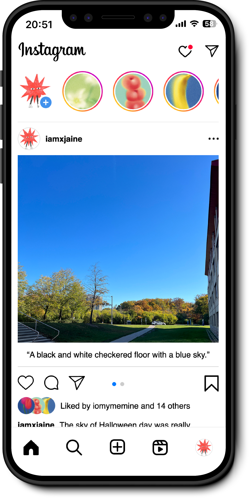

# Improve Instagram Accessibility

<b>✸ Explore the MET's collection with ease, one artwork at a time!</b>  

 
Developed an Instagram-inspired app to enhance accessibility for visually impaired users. Adjusted the position of the Alt Text setting and provided a visually impaired user-friendly interface.

## Features
- Voice Over feature using the Web Speech API from [Educative](https://www.educative.io/)
- Swipe through photos using the API from [Swiper](https://swiperjs.com/)
- Utilized Local Storage to save users' alt text 
- Plan to rebuild the app using React later!

## Built with
- Vanilla Web Stack
- APIs
- Visual Studio Code
- Educative
- Swiper
